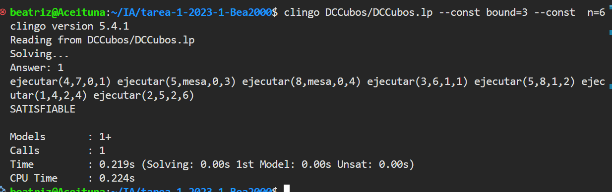
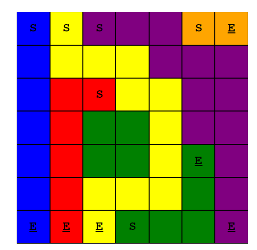

# AI Assignment - Block World Problem and Connect Puzzle Solver

This repository contains the solution for an artificial intelligence assignment as part of the **Engineering** program at **Pontificia Universidad Católica de Chile**. The project focuses on modeling and solving problems using **Answer Set Programming (ASP)** in **Clingo**. The tasks involve two main challenges: modifying the classic Block World problem to allow multiple robotic arms and solving the Connect Puzzle from the mobile game *Pou*.

## Project Structure

- **DCCubos.lp**: The ASP implementation of the Block World problem.
- **DCConnect.lp**: The ASP program to solve the Connect Puzzle.
- **visualizer/**: Includes tools to visualize the solution to the Connect Puzzle.
- **report/**: Contains experimental evaluations and conclusions.

## Requirements

To run this project, you need:

- **Clingo** (version 5.5.0 or higher): A powerful ASP solver.
- **Python 3.x**: For parsing the output of Clingo when solving the Connect Puzzle.

## Task 1: Block World Problem (DCCubos)

### Problem Description

The classic **Block World Problem** involves a set of blocks stacked on a table, which can be moved one at a time by a robotic arm. The goal is to move blocks from an initial configuration to a target configuration. In this task, we extend the problem to allow **multiple robotic arms** to move blocks simultaneously, while ensuring the physics of the problem remains intact (e.g., no two blocks can be placed or removed from the same stack at the same time).



### How to Run

1. Modify `DCCubos.lp` to specify the number of robotic arms.
2. Run the program using the following command:

    ```bash
    clingo DCCubos/DCCubos.lp --const bound=B --const  n=N
    ```

    Replace `B` with the number of time units available to solve the problem. This controls how much time the program has to reach the goal state. Replace `N` with the number of robotic arms to use.

3. Test different configurations by adjusting the number of robotic arms and the problem complexity.

### Experimental Evaluation

The experimental section involves testing the solution on at least 20 problems with varying difficulty, using 1, 3, and 5 robotic arms. Results include:

- Solution Time: The time it takes to solve each problem variant.
- Completion Time: The number of time units needed to reach the goal state.
Results are presented as graphs in the `report/` directory.

## Task 2: Connect Puzzle Solver (DCConnect)

### Problem Description

The Connect Puzzle is a game where players must connect pairs of colored cells on an `m x n` grid without crossing paths. All cells on the grid must be used. The puzzle is solved by finding non-overlapping paths between pairs of colored cells.



### How to Run

1. Place your ASP solution for the Connect Puzzle inside the visualizer/ directory.
2. Run the following command to solve the puzzle and generate an output file:

    ```bash
    clingo DCConnect.lp | python visualizer/parser.py output.json
    ```

3. `Open index.html` in a browser and select the generated output.json file to visualize the solution.

### Example

To solve the Connect Puzzle with a specific input grid:

```bash
clingo DCConnect.lp --outf=2 | python visualizer/parser.py output.json
```

### Experimental Evaluation

Evaluate the performance of the solution using various puzzle instances. The report includes metrics on:

- Execution Time: Time taken by Clingo to find a solution.
- Number of Actions: Minimize the number of actions taken to solve the puzzle.

## Conclusion

The assignment emphasizes modeling problems using ASP and solving them efficiently with Clingo. The experiments demonstrate how the number of robotic arms impacts solution time and how minimizing actions affects execution time in puzzle-solving tasks.

## Visualizer

The visualizer allows you to observe the solutions for the Connect Puzzle. To use it:

- Ensure the output.json file is in the visualizer/ directory.
- Open index.html in your browser.
- Select the output.json file to view the solution paths.